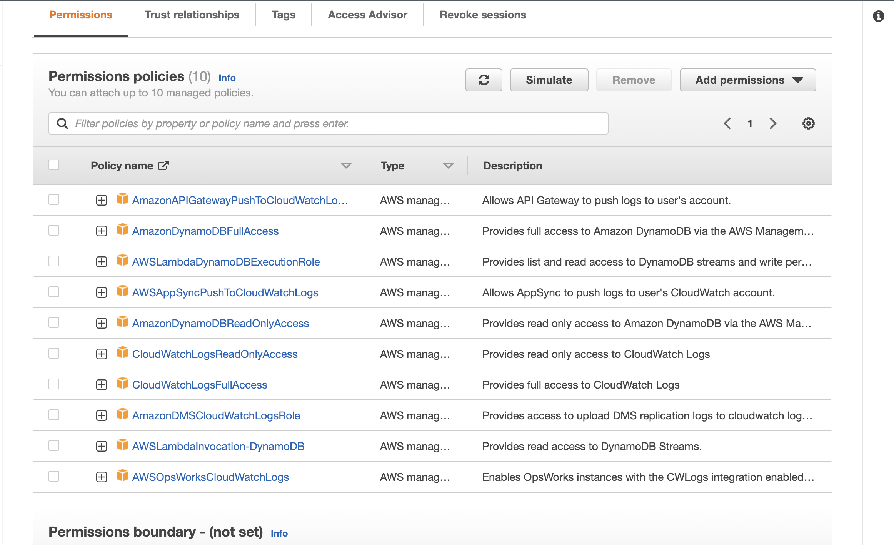
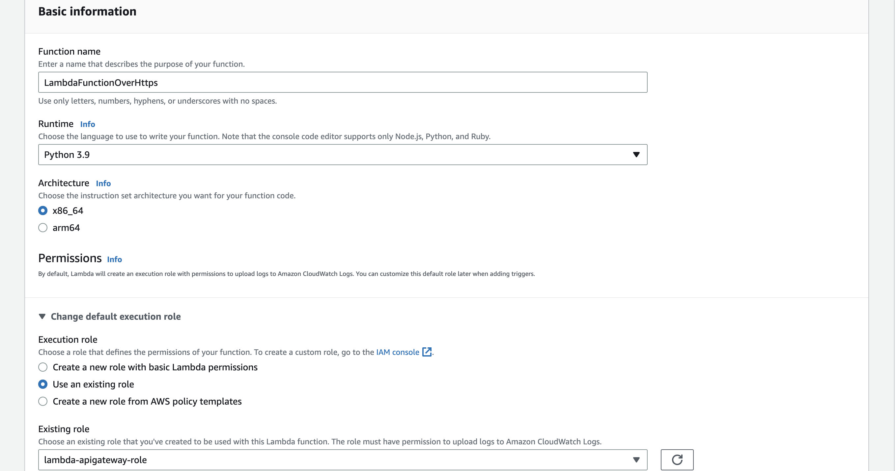
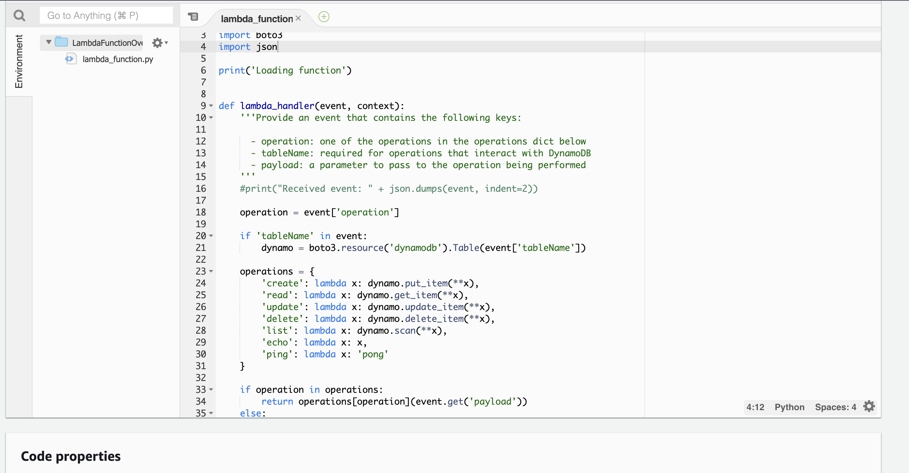
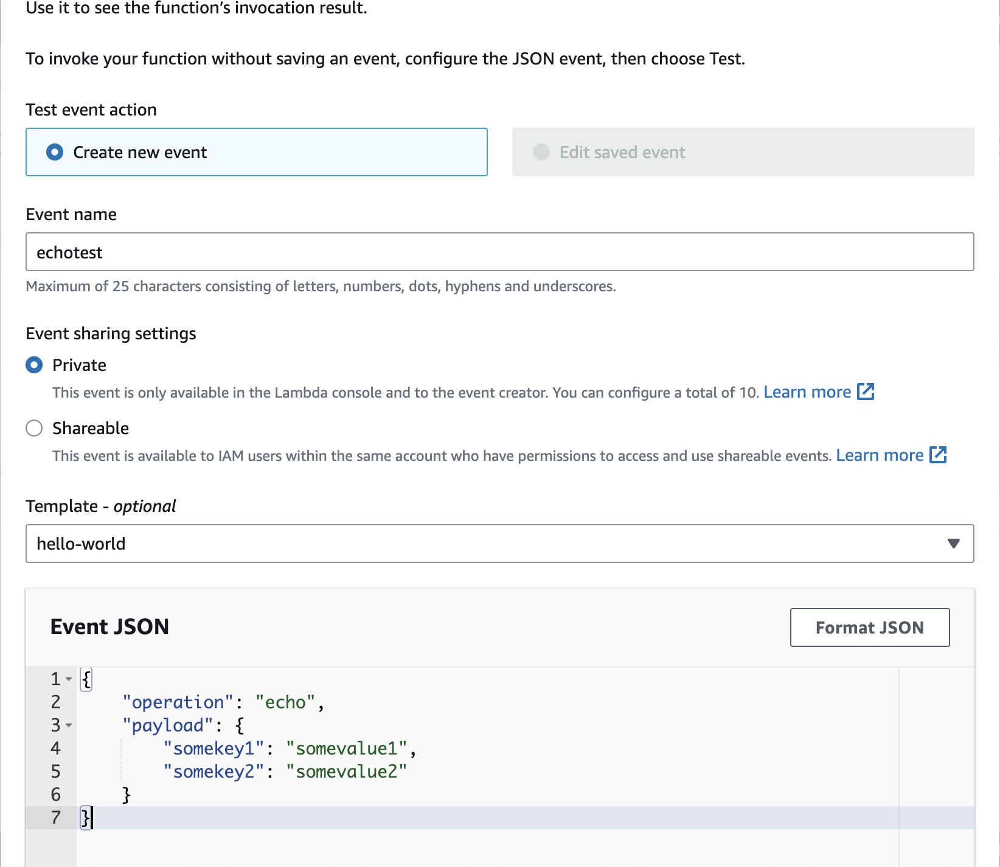
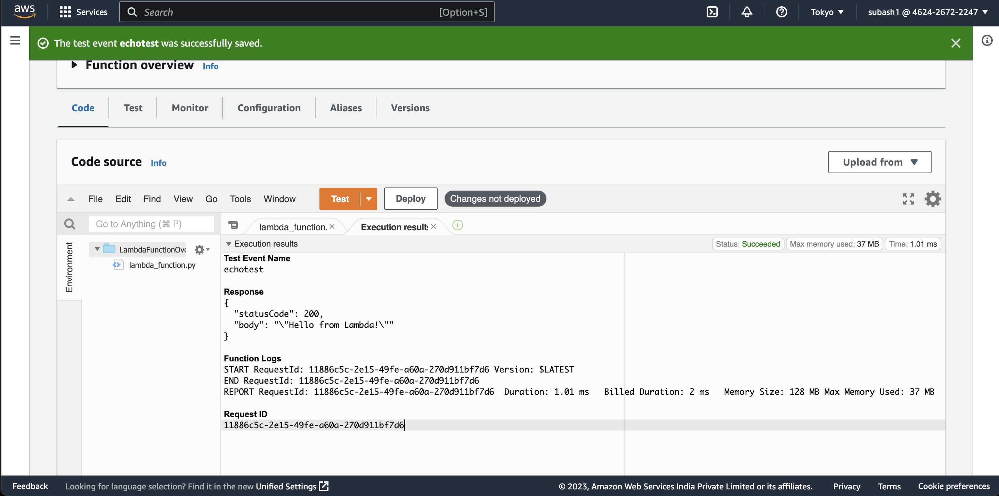
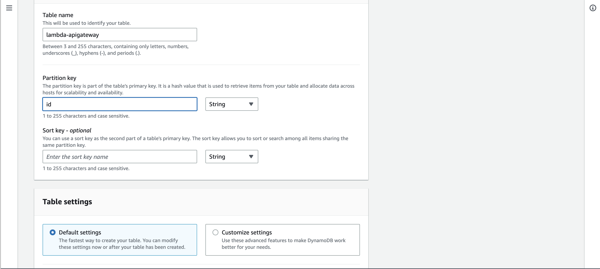
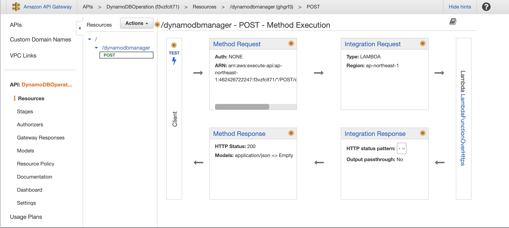
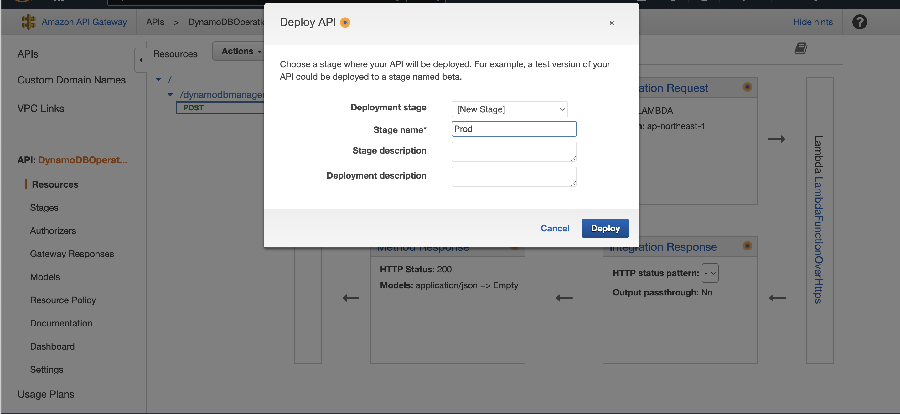
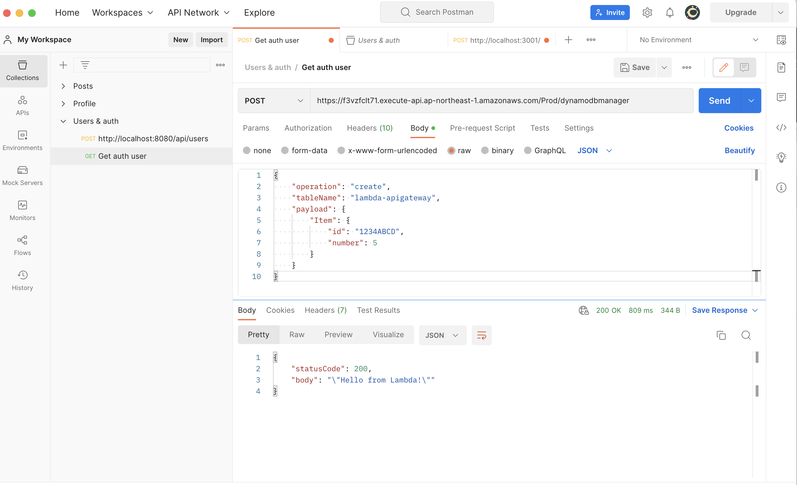

# Serverless AWS lambda

## Step1:Planning AWS Architecture

## Step2: Create IAMrole Policies to CRUD operations

## Step3: Create Lambda

## Step4: Code to trigger lambda function

## Step5: Status check in echotest

## Step6: Create DynamoDB

## Step7: Create AWS API Gateway

## Step8 : Deploy API

## Step9:Check status of Postman POSTAPI 

### Finally delete all Services 

